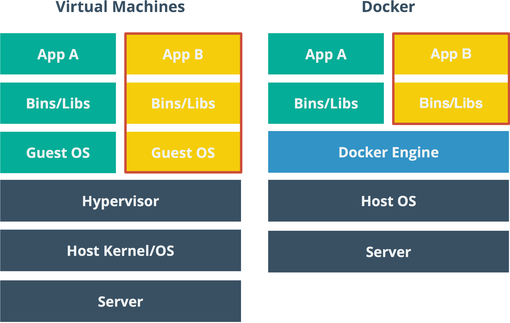

# En este repo se vera el proceso de aprender docker.

En este repo podremos encontrar mi proceso mediante ente estudio docker y algunos comando útiles este repo más que todo es para llevar un seguimiento en mis repositorios.

## 

